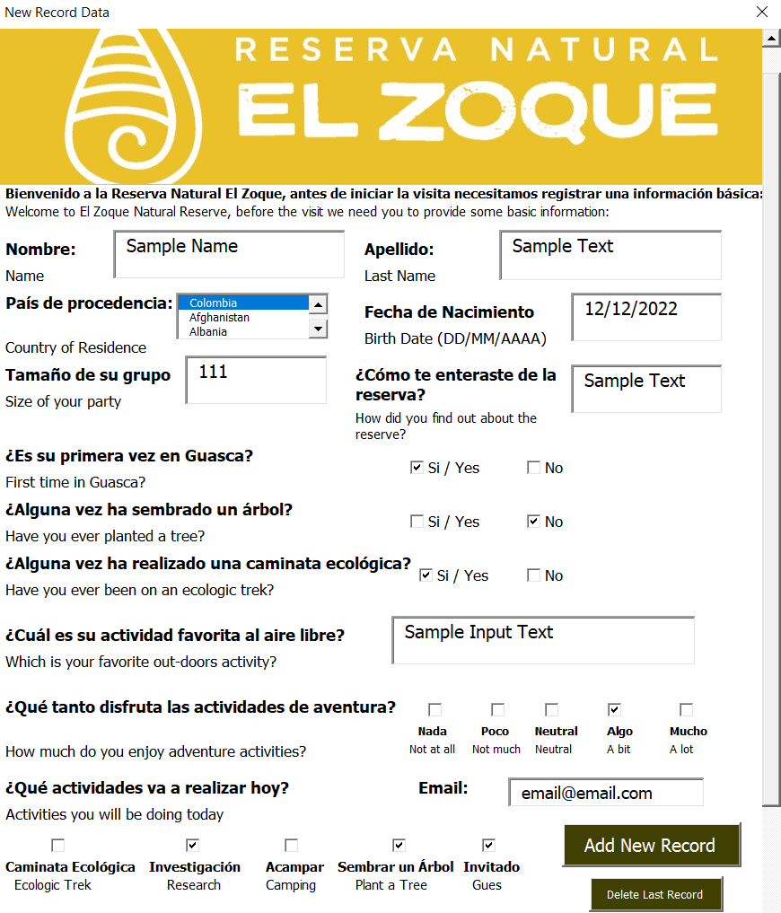
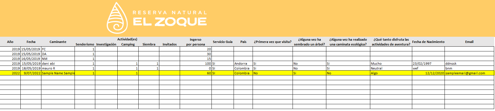
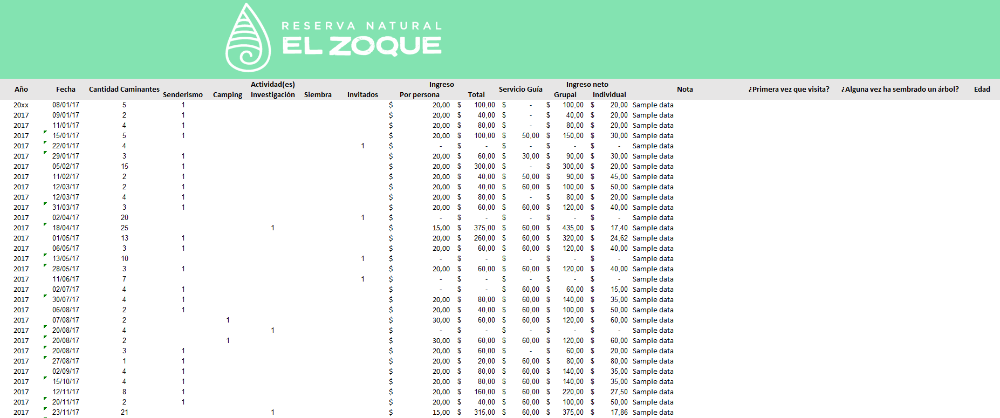

# Automated Data Entry 

This is a desktop business solution that automates customers data entry through a windows form. This user form updates and sets new records in a local data set that should populate a SQl server data base using an ADO Visual Basic Connection.

 

Sample:

https://github.com/DanielHzp/AutomatedDataEntryInterface/blob/008e10f2cf1220aa50287400b1cd368b2515bd22/On%20Click%20Actions/InsertDataDB.bas#L4-L43

 

The user must load the form clicking on an excel macro button,then the following attributes must be filled out and an option to automatically write data on the dataset becomes available:

 

 

 

 

The form contains a 'Add New Record' button and an option to clean all the user input fields. Additionally, a 'Delete Record' button lets the user select which record should be deleted. When the user clicks on the 'save' option, all new input fields are added to a new row in the following dataset which is synchronized with a SQL business server connection:

 

 
Additionally, the solution performs calculations in a Macro in order to update the following data set:

 

 

 

 

## Usage

The form can be executed by importing the .frx and .bas files in a VB developer editor windows forms.

